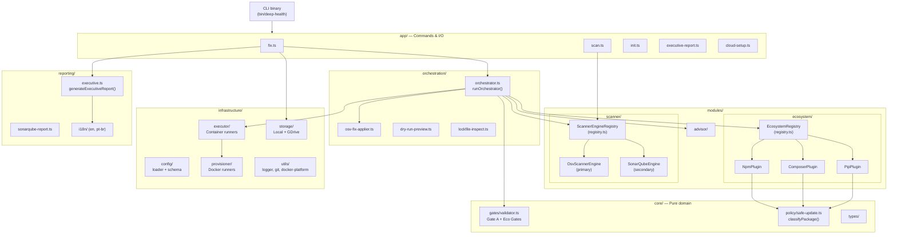
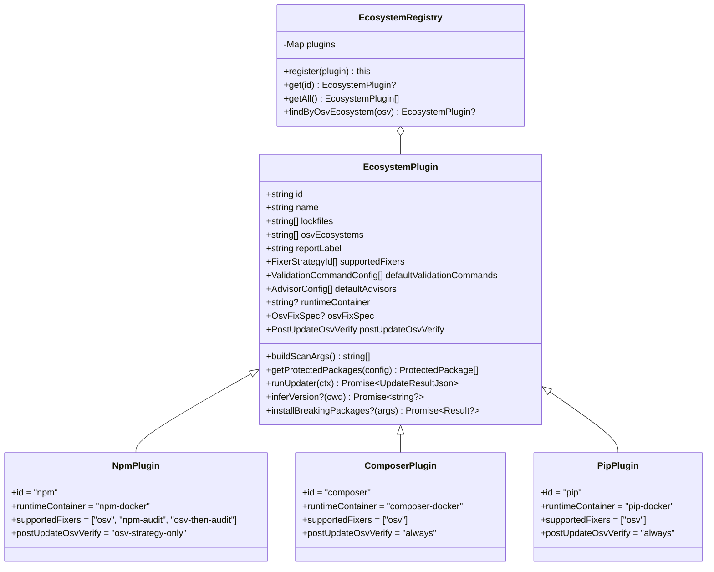
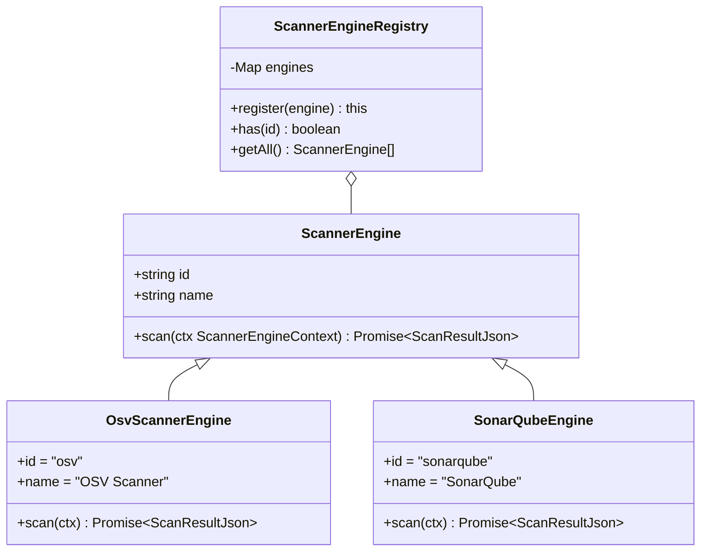
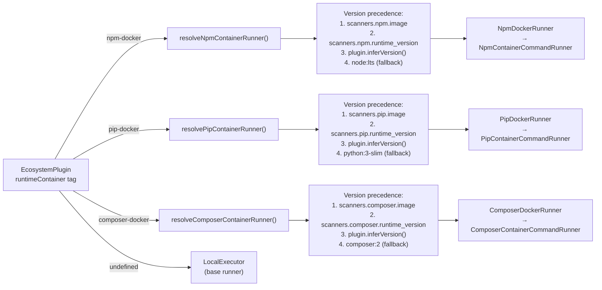
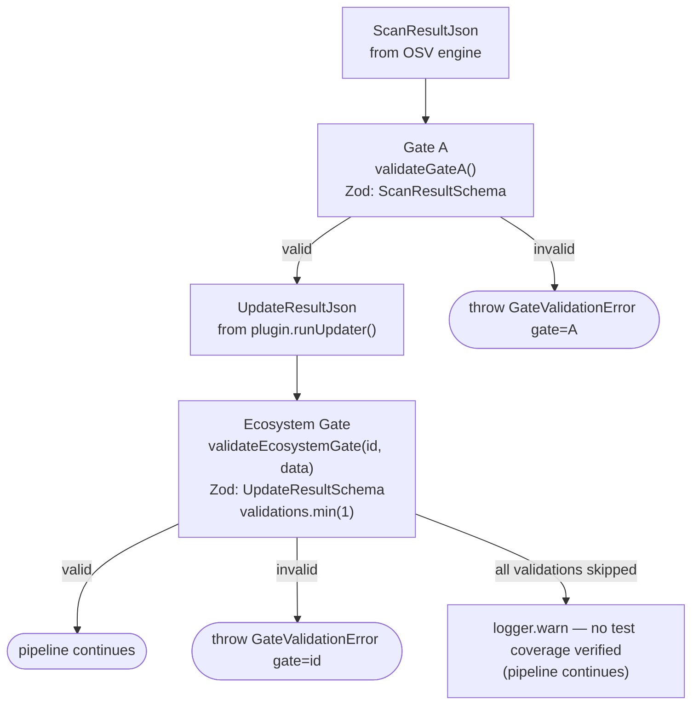
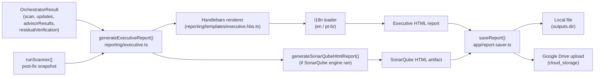
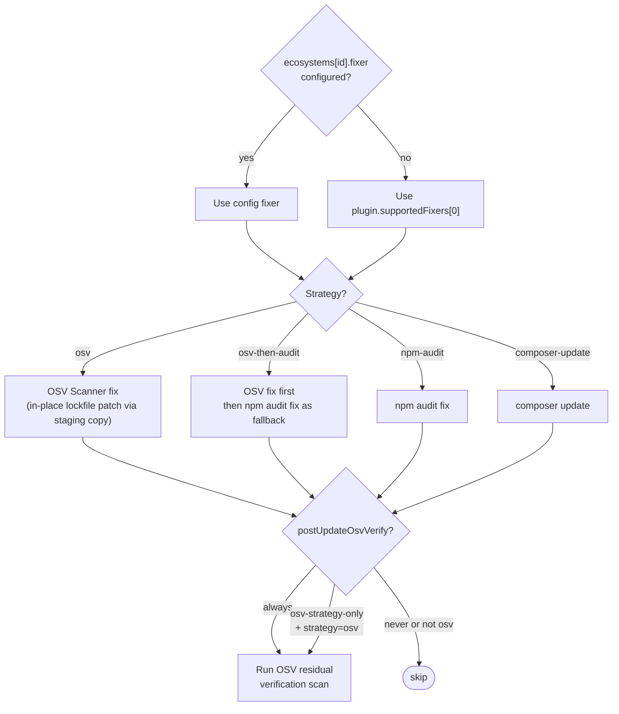

# Architecture — deep-health

## High-Level Architecture



---

## Orchestrator Pipeline Flow

The `runOrchestrator()` function in `orchestration/orchestrator.ts` owns the full `fix` pipeline.

```mermaid
flowchart TD
    START([runOrchestrator called]) --> PRE_SNAP

    PRE_SNAP["Take pre-run snapshots\npackage.json + package-lock.json"]
    PRE_SNAP --> PHASE_CHECK

    PHASE_CHECK{"scan phase\nenabled?"}
    PHASE_CHECK -- no --> SKIP_SCAN([return: status=skipped])
    PHASE_CHECK -- yes --> ENGINES

    ENGINES["Run all scanner engines\n(OSV primary + SonarQube secondary)"]
    ENGINES --> GATE_A

    GATE_A{"Gate A\nvalidation\n(Zod)"}
    GATE_A -- fail --> GATE_ERR([throw GateValidationError])
    GATE_A -- pass --> KILL_SW

    KILL_SW{"DEEP_HEALTH_NO_AUTO_FIX\nenv var set?"}
    KILL_SW -- yes --> RETURN_SCAN([return scan result only])
    KILL_SW -- no --> PLUGINS

    PLUGINS["Iterate active ecosystem plugins\n(registration order: npm → composer → pip)"]
    PLUGINS --> PHASE_PLUGIN

    PHASE_PLUGIN{"plugin phase\nenabled?"}
    PHASE_PLUGIN -- no --> NEXT_PLUGIN
    PHASE_PLUGIN -- yes --> ADVISORS

    ADVISORS["Run advisors\n(informational, never blocks)"]
    ADVISORS --> HAS_UPDATES

    HAS_UPDATES{"auto_safe vulns > 0\nor breaking vulns + authorized?"}
    HAS_UPDATES -- no --> NEXT_PLUGIN
    HAS_UPDATES -- yes --> RESOLVE_RUNNER

    RESOLVE_RUNNER["Resolve container runner\n(npm-docker / pip-docker / composer-docker)"]
    RESOLVE_RUNNER --> OSV_STAGING

    OSV_STAGING["OSV staging-fix\n(if strategy=osv or osv-then-audit)"]
    OSV_STAGING --> DRY_PREVIEW

    DRY_PREVIEW["Dry-run preview\n(if --dry-run)"]
    DRY_PREVIEW --> RUN_UPDATER

    RUN_UPDATER["plugin.runUpdater()"]
    RUN_UPDATER --> BREAKING

    BREAKING{"authorizeBreaking\n+ plugin.installBreakingPackages?"}
    BREAKING -- yes --> INSTALL_BREAKING["Install breaking packages"]
    BREAKING -- no --> OSV_VERIFY
    INSTALL_BREAKING --> OSV_VERIFY

    OSV_VERIFY{"postUpdateOsvVerify\npolicy?"}
    OSV_VERIFY -- "always or osv-strategy-only\n(when strategy=osv)" --> RUN_VERIFY["Run OSV residual\nverification scan"]
    OSV_VERIFY -- never --> ECO_GATE
    RUN_VERIFY --> ECO_GATE

    ECO_GATE{"Ecosystem gate\nvalidation (Zod)"}
    ECO_GATE -- fail --> GATE_ERR2([throw GateValidationError])
    ECO_GATE -- pass --> CHECK_ERR

    CHECK_ERR{"updateResult.status\n= error?"}
    CHECK_ERR -- yes --> PIPELINE_STOP([stop pipeline, set overallStatus=error])
    CHECK_ERR -- no --> NEXT_PLUGIN

    NEXT_PLUGIN{more\nplugins?}
    NEXT_PLUGIN -- yes --> PHASE_PLUGIN
    NEXT_PLUGIN -- no --> PENDING

    PENDING["Check hasPendingVulns\n(breaking or manual vulns remain)"]
    PENDING --> DONE([return OrchestratorResult])
```



---

## Plugin System (EcosystemPlugin)

Each package manager is a plugin that implements the `EcosystemPlugin` interface (`modules/ecosystem/types.ts`).



**Adding a new ecosystem:**

1. Create `src/modules/ecosystem/plugins/<name>.ts` implementing `EcosystemPlugin`.
2. Register it in `src/modules/ecosystem/index.ts`.
3. Add a Docker runner in `src/infrastructure/provisioner/` if needed.
4. Add a container executor in `src/infrastructure/executor/`.
5. Add the `runtimeContainer` tag resolution in `orchestrator.ts` (the `resolveXxxContainerRunner` pattern).

---

## Safe-Update Classification

`core/policy/safe-update.ts:classifyPackage()` evaluates every vulnerable package against semver rules and the project's `protected_packages` config.


---

## Scanner Engine System



**Primary vs secondary engine:**

- **Primary** = engine with `id === 'osv'`. Its result drives Gate A. Any failure is fatal.
- **Secondary** = all other engines (e.g. SonarQube). Failures are governed by `on_failure: 'warn' | 'fail'` (default: `'warn'` for SonarQube, `'fail'` for unknown engines).

---

## Container Runner Resolution



---

## Gate System



**Key constraint:** `validations` array must always have at least one entry. When tests are not run (e.g., dry-run), emit a `{ name: ..., status: 'skipped' }` entry. An empty array fails the gate.

---

## Report Generation Flow



---

## Fixer Strategy Decision Tree



---

## Module Dependency Rules

```
app/         → orchestration, modules, core, infrastructure, reporting
orchestration → modules, core, infrastructure
modules/ecosystem → core, infrastructure
modules/scanner   → core, infrastructure
reporting    → core, infrastructure
infrastructure → core (types only — no business logic)
core/        → (no internal imports — pure domain)
```

`core/` is the dependency root. Nothing in `core/` imports from `infrastructure/`, `modules/`, `app/`, or `orchestration/`. This boundary is enforced by convention — any import from `@infra/` inside `@core/` is a contract violation.
