# Architecture — deep-health

## High-Level Architecture

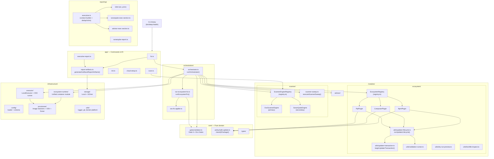

---

## Orchestrator Pipeline Flow

The `runOrchestrator()` function in `orchestration/orchestrator.ts` owns the full `fix` pipeline.

```mermaid
flowchart TD
    START([runOrchestrator called]) --> PRE_SNAP

    PRE_SNAP["Take pre-run snapshots\npackage.json + package-lock.json"]
    PRE_SNAP --> PHASE_CHECK

    PHASE_CHECK{"scan phase\nenabled?"}
    PHASE_CHECK -- no --> SKIP_SCAN([return: status=skipped])
    PHASE_CHECK -- yes --> ENGINES

    ENGINES["Run all scanner engines\n(OSV primary + SonarQube secondary)"]
    ENGINES --> GATE_A

    GATE_A{"Gate A\nvalidation\n(Zod)"}
    GATE_A -- fail --> GATE_ERR([throw GateValidationError])
    GATE_A -- pass --> KILL_SW

    KILL_SW{"DEEP_HEALTH_NO_AUTO_FIX\nenv var set?"}
    KILL_SW -- yes --> RETURN_SCAN([return scan result only])
    KILL_SW -- no --> PLUGINS

    PLUGINS["Iterate active ecosystem plugins\n(registration order: npm → composer → pip)"]
    PLUGINS --> PHASE_PLUGIN

    PHASE_PLUGIN{"plugin phase\nenabled?"}
    PHASE_PLUGIN -- no --> NEXT_PLUGIN
    PHASE_PLUGIN -- yes --> ADVISORS

    ADVISORS["Run advisors<br/>(informational, never blocks)"]
    ADVISORS --> RUN_ECO_FIX

    subgraph runEcosystemFix["runEcosystemFix() — src/orchestration/run-ecosystem-fix.ts"]
        direction TB
        RUN_ECO_FIX([runEcosystemFix called]) --> HAS_UPDATES

        HAS_UPDATES{"auto_safe vulns > 0<br/>or breaking vulns + authorized?"}
        HAS_UPDATES -- no --> SKIPPED([return: status=skipped])
        HAS_UPDATES -- yes --> RESOLVE_RUNNER

        RESOLVE_RUNNER["Resolve effective runner<br/>via Ecosystem Runtime Container<br/>(includes native_deps preamble)"]
        RESOLVE_RUNNER --> LOCK_DEMOTE

        LOCK_DEMOTE{"npm + osv/osv-then-audit<br/>+ lockfileVersion=1?"}
        LOCK_DEMOTE -- yes --> AUTO_DEMOTE["Auto-demote fixer → npm-audit\n(osv-scanner cannot patch v1 lockfiles)"]
        LOCK_DEMOTE -- no --> OSV_STAGING
        AUTO_DEMOTE --> OSV_STAGING

        OSV_STAGING["OSV staging-fix<br/>(if effective strategy=osv or osv-then-audit)"]
        OSV_STAGING --> DRY_PREVIEW

        DRY_PREVIEW["Dry-run preview<br/>(if --dry-run)"]
        DRY_PREVIEW --> RUN_UPDATER

        RUN_UPDATER["plugin.runUpdater()<br/>via runUpdaterLifecycle()"]
        RUN_UPDATER --> BREAKING

        BREAKING{"authorizeBreaking<br/>+ plugin.installBreakingPackages?"}
        BREAKING -- yes --> INSTALL_BREAKING["Install breaking packages"]
        BREAKING -- no --> OSV_VERIFY
        INSTALL_BREAKING -- error --> ABORT_BREAKING([return: status=error])
        INSTALL_BREAKING -- ok --> OSV_VERIFY

        OSV_VERIFY{"postUpdateOsvVerify<br/>policy?"}
        OSV_VERIFY -- "always or osv-strategy-only<br/>(when strategy=osv)" --> RUN_VERIFY["Run OSV residual<br/>verification scan"]
        OSV_VERIFY -- never --> ECO_GATE
        RUN_VERIFY --> ECO_GATE

        ECO_GATE{"Ecosystem gate<br/>validation (Zod)"}
        ECO_GATE -- fail --> GATE_ERR2([throw GateValidationError])
        ECO_GATE -- pass --> SUCCESS_OR_ERR

        SUCCESS_OR_ERR{"updateResult.status<br/>= error?"}
        SUCCESS_OR_ERR -- yes --> RET_ERR([return: status=error])
        SUCCESS_OR_ERR -- no --> RET_SUCCESS([return: status=success])
    end

    SKIPPED --> NEXT_PLUGIN
    RET_SUCCESS --> NEXT_PLUGIN
    RET_ERR --> PIPELINE_STOP([stop pipeline, set overallStatus=error])
    ABORT_BREAKING --> PIPELINE_STOP

    NEXT_PLUGIN{more\nplugins?}
    NEXT_PLUGIN -- yes --> PHASE_PLUGIN
    NEXT_PLUGIN -- no --> PENDING

    PENDING["Check hasPendingVulns\n(breaking or manual vulns remain)"]
    PENDING --> DONE([return OrchestratorResult])
```

---

## Plugin System (EcosystemPlugin)

Each package manager is a plugin that implements the `EcosystemPlugin` interface (`modules/ecosystem/types.ts`).

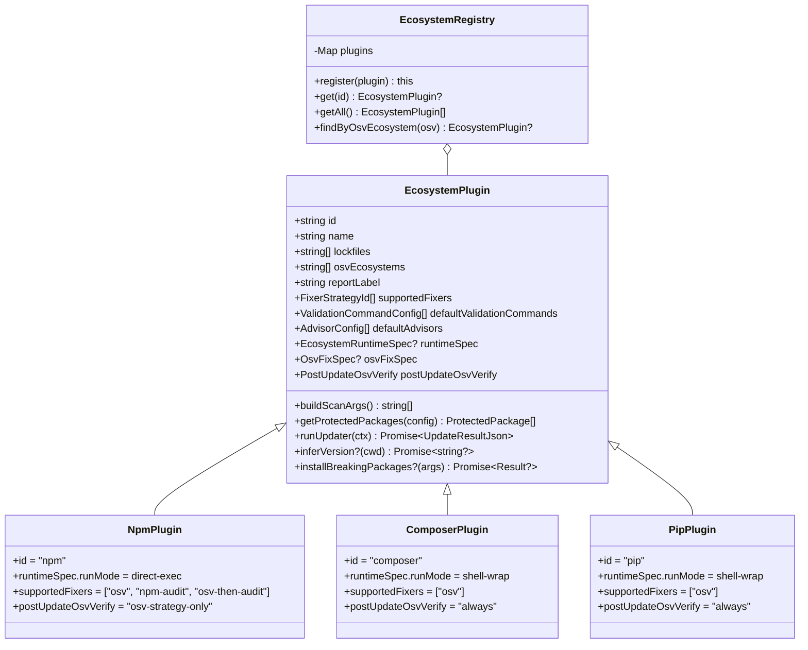

**Adding a new ecosystem:**

1. Create `src/modules/ecosystem/plugins/<name>.ts` implementing `EcosystemPlugin`.
2. Declare a `runtimeSpec: EcosystemRuntimeSpec` on the plugin object — see [Ecosystem Runtime Container](#ecosystem-runtime-container) for the spec shape.
3. Register the plugin in `src/modules/ecosystem/index.ts`.

No new files in `infrastructure/`, no orchestrator edits. The unified runtime module reads `runtimeSpec` and wires the entire container chain.

---

## Per-Ecosystem Fix Flow (`runEcosystemFix`)

`src/orchestration/run-ecosystem-fix.ts` encapsulates the per-plugin sub-pipeline that the orchestrator dispatches to once per active plugin. The orchestrator owns: phase filtering, advisors, fan-out across plugins, and result aggregation. Everything between "we're about to run plugin X" and "X returned an outcome" lives in `runEcosystemFix`.

```ts
export type RunEcosystemFixOutcome =
  | { status: 'skipped'; reason: 'no-updates' }
  | { status: 'success'; updateResult: UpdateResultJson; residualVerification?: ResidualVerification }
  | { status: 'error'; updateResult: UpdateResultJson };
```

**Why the seam exists:** before this extraction, the orchestrator's plugin loop body was ~193 lines mixing 15 distinct concerns. Tests of any single concern required full orchestrator setup (registry, scanner engines, Gate A wiring). After extraction, `runEcosystemFix` is testable directly with fake plugins — no scanner, no orchestrator. See `tests/unit/orchestration/run-ecosystem-fix.test.ts`.

**Throws** `GateValidationError` when the ecosystem gate fails. Otherwise always returns an outcome — including the breaking-install short-circuit, which returns `'error'` without running residual verification or gate validation (mirroring legacy semantics).

---

## Updater Transaction (`beginUpdaterTransaction`)

`src/modules/ecosystem/utils/updater-transaction.ts` concentrates the duplicated revert/result-building boilerplate that previously lived in three updaters (`npm-updater.ts`, `composer-updater.ts`, `pip-updater.ts`).

**This module is no longer called directly by updaters.** It is invoked by `runUpdaterLifecycle()` (see [Updater Lifecycle](#updater-lifecycle-runupdaterlifecycle) below), which orchestrates the full probe → fix → validate → revert sequence. Updaters supply an `UpdaterRecipe<T>` to the lifecycle function instead of calling `beginUpdaterTransaction` themselves.

The transaction is created with a `BootstrapSpec` (`{ binary, args, label }`) that describes how to reinstall dependencies during revert (e.g. `npm ci`, `composer install --no-interaction --no-scripts`, `pip install -r requirements.txt`). The transaction owns the full revert protocol internally: `restore → bootstrap → restore-byte-identical → warn-only dirty-tree check`.

```ts
const tx = await beginUpdaterTransaction({
  files: NPM_FILES,        // backed up at start (or adopt preExistingBackups)
  base,                    // pre-built success-shaped UpdateResultJson
  cwd,
  runner,
  bootstrapSpec: { binary: 'npm', args: ['ci'], label: 'npm ci' },
  preExistingBackups,      // optional — adopt caller-supplied backups (osv staging-fix)
});

// Happy path:
return tx.success({ packages_updated, validations: validationResult.entries });

// Failure path — transaction runs restore→bootstrap→restore revert internally:
return tx.abortWithError({
  error: 'Validations failed after npm update — changes reverted',
  validations: validationResult.entries,
});
```

**Contract:** `abortWithError` runs the revert protocol and lets bootstrap failures propagate. If `npm ci` (or `composer install`, `pip install`) fails during revert, the error throws — the lifecycle's outer `try/catch → PhaseError` wraps it. This surfaces ambiguous on-disk state rather than silently continuing.

**BootstrapSpec** is supplied once at transaction creation and is distinct from `ProbeSpec` (which drives the pre-flight environment check in the Ecosystem Environment Probe). Bootstrap drives revert only.

**Why this seam:** three updaters each repeated ~25 lines of "build skipped entries + base UpdateResultJson + outer error-result spread" before the deepening. A bug in revert correctness (e.g. the npm "double-restore after `npm ci` lockfile-format normalization" trick) had three places to be remembered. After the deepening, the result-shaping invariant lives in one 60-line module.

---

## Updater Lifecycle (`runUpdaterLifecycle`)

`src/modules/ecosystem/utils/updater-lifecycle.ts` is the generic skeleton shared by all three ecosystem updaters (npm, pip, composer). It owns the full sequence from pre-flight probe through fix, validation, partial revert, and final success or abort — eliminating the need for each updater to duplicate that orchestration.

Updaters no longer call `beginUpdaterTransaction` directly. Instead they define an `UpdaterRecipe<TFixerResult>` and pass it to `runUpdaterLifecycle()`, which drives the lifecycle and delegates low-level revert bookkeeping to the transaction.

### Lifecycle Flowchart

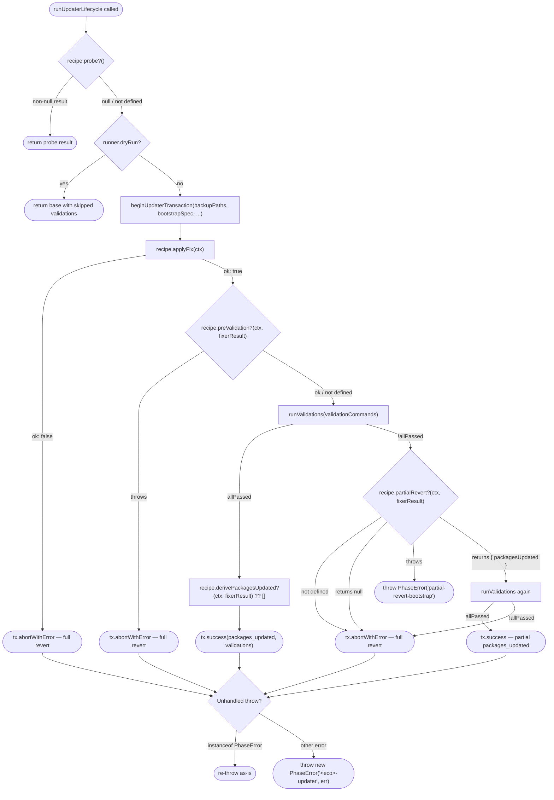

### `UpdaterRecipe<T>` Interface

```ts
interface UpdaterRecipe<TFixerResult = void> {
  agentName: string;          // e.g. 'npm-updater'
  ecosystemKey: string;       // e.g. 'npm', 'pip', 'composer'
  backupPaths: string[];      // files backed up at transaction start
  bootstrapSpec: BootstrapSpec; // how to reinstall deps during revert

  probe?(ctx): Promise<UpdateResultJson | null>;
  applyFix(ctx): Promise<FixResult<TFixerResult>>;
  preValidation?(ctx, fixerResult): Promise<void>;
  derivePackagesUpdated?(ctx, fixerResult): Promise<string[]>;
  partialRevert?(ctx, fixerResult): Promise<{ packagesUpdated: string[] } | null>;
}
```

`FixResult<T>` is `{ ok: true; value: T } | { ok: false; error: string; validationStatus?: 'fail' | 'skipped' }`.

### Recipe-to-Ecosystem Mapping

| Hook | npm | pip | composer |
|---|---|---|---|
| `probe` | — | — | `runEcosystemEnvironmentProbe` |
| `applyFix` | `FIXER_MAP[strategy]` dispatch | `pip install -U` | `composer update` + automationArgs |
| `preValidation` | `npm ci` (stream: true) | — | — |
| `partialRevert` | `fixerResult.partialRevert` → osv-only packages | — | — |
| `derivePackagesUpdated` | `fixerResult.packagesUpdated` | `parsePipInstalledVersions` | diff `composer.lock` before/after |

---

## Ecosystem Environment Probe

`src/modules/ecosystem/utils/environment-probe.ts` provides a pre-flight check that verifies an ecosystem CLI can run cleanly inside the active runner **before any mutation begins**.

```ts
interface ProbeSpec {
  binary: string;
  args: string[];
  cwd: string;
  errorPrefix: string;  // prefix for user-facing error messages
  label: string;        // display name for logging
}

type ProbeResult =
  | { ok: true }
  | { ok: false; exitCode: number; detail: string; error: string };
```

**Usage:** call `runEcosystemEnvironmentProbe(runner, spec)` at the start of an updater before taking any file snapshots or running fix commands. Currently adopted by `composer-updater.ts`. If the probe fails, the updater returns an `UpdateResultJson` with `status: 'error'` and a `'Composer environment mismatch: …'` prefix — no files are modified.

**Distinct from `BootstrapSpec`:** `BootstrapSpec` describes how to reinstall dependencies during a revert (inside the Updater Transaction). `ProbeSpec` is a read-only availability check — it never modifies files.

---

## Safe-Update Classification

`core/policy/safe-update.ts:classifyPackage()` evaluates every vulnerable package against semver rules and the project's `protected_packages` config.

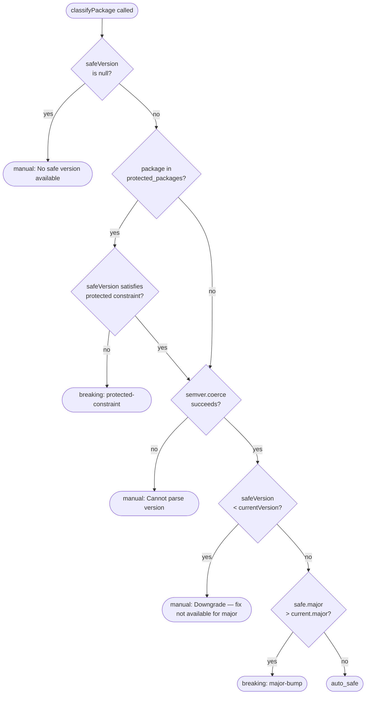

---

## Scanner Engine System

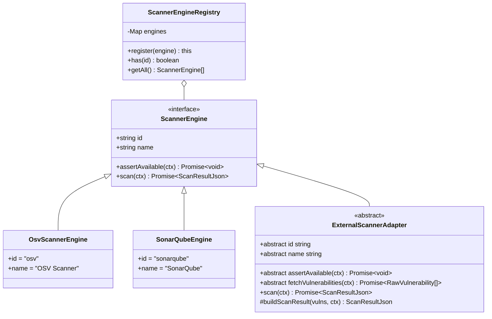

**Primary vs secondary engine:**

- **Primary** = engine whose `id` matches `config.scanners.primary` (defaults to `'osv'` when not configured). Its result drives Gate A. Any failure is fatal.
- **Secondary** = all other registered engines. Failures are governed by `on_failure: 'warn' | 'fail'` (default: `'warn'` for SonarQube, `'fail'` for unknown engines).

---

## Scanner Sweep

`src/modules/scanner/scanner-sweep.ts` encapsulates the multi-engine scan stage that was previously inlined in `runOrchestrator()`. It runs all registered scanner engines, classifies results into entries vs warnings, and applies the `on_failure` policy for secondary engines.

**Key design points:**

- **Config-agnostic:** the `resolveOnFailure` policy resolver is injected as a callback by the orchestrator, keeping the sweep module free of config imports.
- **Renderer-agnostic:** an `EngineRunRenderer` adapter controls visual presentation. Two implementations: `listr2ScannerSweepRenderer` (builds a Listr2 task list with progress, used in interactive mode) and `silentScannerSweepRenderer` (sequential, no UI — used in tests and JSON-output mode).
- **`PrimaryEngineFailure`:** typed exception thrown when the primary engine fails. Carries `{ engineId, cause, partialWarnings }`. `partialWarnings` preserves any warnings already accumulated from secondary engines that ran before the primary failed — they are forwarded in error diagnostics rather than discarded.

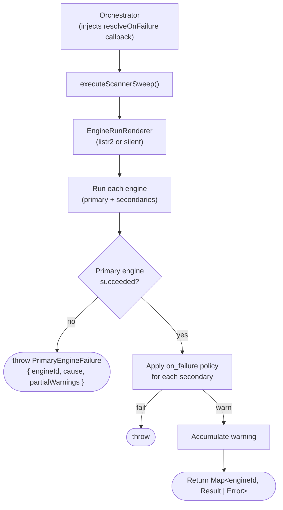

---

## Ecosystem Runtime Container

`src/infrastructure/ecosystem-runtime/` is the unified seam through which a plugin's CLI runs in an ephemeral Docker container. One module replaces what used to be three triplicated runner trios (executor + resolver + provisioner). See [ADR-0001](./adr/0001-docker-only-runtime.md) for the docker-only decision.

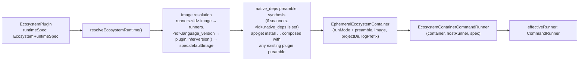

### EcosystemRuntimeSpec

Declarative description of how an ecosystem's CLI runs in a container. Lives on the plugin as `runtimeSpec`:

```ts
interface EcosystemRuntimeSpec {
  defaultImage: string;
  resolveImage: (version: string | undefined) => string;
  containerBinaries: readonly string[];
  runMode: RunMode;
}

type RunMode =
  | { kind: 'direct-exec'; binary: string; preamble?: (image: string) => string | undefined }
  | { kind: 'shell-wrap'; preamble?: (image: string) => string | undefined };
```

### Run Modes

| `runMode.kind` | Used by | Final docker invocation |
|---|---|---|
| `direct-exec` (no preamble) | npm | `docker run <image> <binary> <args...>` |
| `direct-exec` (with preamble) | npm + `native_deps` | `docker run <image> sh -lc '<preamble> && exec "$@"' -- <binary> <args...>` |
| `shell-wrap` | pip, composer | `docker run <image> sh -lc "[<preamble> && ]<args joined>"` |

Both run modes support an optional `preamble` function. It is consulted per invocation with the resolved image and may return `undefined` to skip injection for that specific image.

- **`shell-wrap` preamble** — used by composer to inject `COMPOSER_BOOTSTRAP` when the image is a bare `php:*-cli` that does not pre-install composer.
- **`direct-exec` preamble** — used when `native_deps` is configured in `runners.npm` (or `pip`/`composer`). `resolveEcosystemRuntime` synthesizes an `apt-get install` preamble and injects it before the binary. When a preamble is present, the executor switches to `sh -lc '…' -- binary args`, preserving the SEC-004 trust boundary: original argv tokens remain independent shell word elements via `"$@"` and are never re-tokenized.

When both a `native_deps` preamble (from config) and a plugin preamble (from `runtimeSpec`) are present, `resolveEcosystemRuntime` composes them: `<native_deps_apt_cmd> && <plugin_preamble>`.

`runShell()` always uses `sh -c` (without `-l`), preserving legacy behavior for arbitrary user-supplied validation commands.

### Routing

`EcosystemContainerCommandRunner` routes commands by inspecting the binary against `spec.containerBinaries`:

| Command class | Example | Routed to |
|---|---|---|
| Spec-recognized binary | `runner.runArgs('npm', ['install'])` | Ephemeral container |
| Other CLI command | `runner.run('jest --coverage')` | Container via `runShell()` |
| Host-only command | `runner.runArgs('git', ['push'])` | Host runner |

**Host-only commands** are `git`, `gh`, `open`. They never enter the container regardless of which spec is active.

### Adding a new ecosystem (runtime side)

For a hypothetical `cargo` plugin:

```ts
// src/modules/ecosystem/plugins/cargo.ts
runtimeSpec: {
  defaultImage: 'rust:latest',
  resolveImage: (v) => v ? `rust:${v}` : 'rust:latest',
  containerBinaries: ['cargo'],
  runMode: { kind: 'direct-exec', binary: 'cargo' },
},
```

That declaration alone wires the entire runtime chain — no new provisioner class, no new executor class, no orchestrator edits.

---

## Gate System


**Key constraint:** `validations` array must always have at least one entry. When tests are not run (e.g., dry-run), emit a `{ name: ..., status: 'skipped' }` entry. An empty array fails the gate.

---

## Report Generation Flow

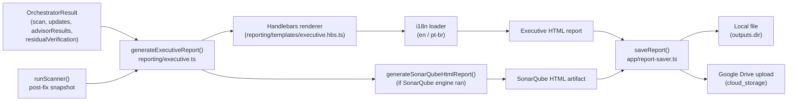

---

## Report Artifacts

`src/app/report-artifacts.ts` centralizes post-pipeline artifact generation that was previously duplicated between `fix.ts` and `executive-report.ts`.

```ts
interface ReportArtifactsInput {
  orchestratorResult: OrchestratorResult;
  config: ProjectConfig;
  cwd: string;
  runner: CommandRunner;
  // … locale, formats, outputDir, etc.
}

async function generateAndSaveReportArtifacts(input: ReportArtifactsInput): Promise<void>
```

Both `fix.ts` (`runFixPipeline`) and `executive-report.ts` delegate their entire report generation phase to this single function. The scan-after snapshot (post-fix OSV scan for residual verification display) is orchestrated internally. `writeAuditTrail()` is intentionally kept in `fix.ts` rather than here — the audit trail is a run-level record, not a report artifact.

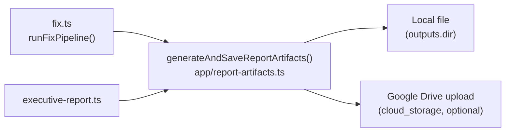

---

## Fixer Strategy Decision Tree

The effective fixer strategy is resolved before any mutation begins. The base strategy comes from config or the plugin default; per-plugin hooks may then override it. For npm, `NpmPlugin.resolveEffectiveFixer(config, cwd)` encapsulates the lockfile-v1 demotion logic — `runEcosystemFix` calls the hook rather than applying npm-specific special-cases inline.

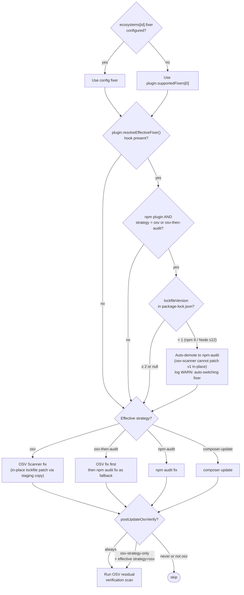

---

## Module Dependency Rules

```
app/         → orchestration, modules, core, infrastructure, reporting
orchestration → modules, core, infrastructure
modules/ecosystem → core, infrastructure
modules/scanner   → core, infrastructure
reporting    → core, infrastructure
infrastructure → core (types only — no business logic)
core/        → (no internal imports — pure domain)
```

`core/` is the dependency root. Nothing in `core/` imports from `infrastructure/`, `modules/`, `app/`, or `orchestration/`. This boundary is enforced by convention — any import from `@infra/` inside `@core/` is a contract violation.

---

## Adding an External Scanner Engine

### When to use `ExternalScannerAdapter` vs `ScannerEngine` directly

Implement `ScannerEngine` directly when:
- The engine produces a result that does not map cleanly to per-package vulnerability entries (e.g., SonarQube code quality gates).
- The engine has complex multi-phase logic that does not decompose into a simple `fetchVulnerabilities()` call.

Extend `ExternalScannerAdapter` when:
- The external source returns vulnerability records that can be normalized to `RawVulnerability[]`.
- You want the base class to handle `ScanResultJson` assembly, `classifyPackage()` calls, and ecosystem bucketing automatically.

This covers the common case: Snyk, WPScan, Patchstack, NVD, and similar CVE-feed tools.

### The 3 abstract members to implement

| Member | Type | Purpose |
|---|---|---|
| `id` | `readonly string` | Unique engine key used in registries, logs, and `result.agent` |
| `name` | `readonly string` | Human-readable display name |
| `assertAvailable(ctx)` | `async` method | Verify the tool/credentials exist; throw if not |
| `fetchVulnerabilities(ctx)` | `async` method | Return `RawVulnerability[]`; return `[]` on non-fatal failures |

### Minimal working example (SnykEngine)

```ts
// src/modules/scanner/snyk-engine.ts (example)
import { ExternalScannerAdapter } from './external-adapter';
import type { ScannerEngineContext } from './types';
import type { RawVulnerability } from './external-adapter';

export class SnykEngine extends ExternalScannerAdapter {
  readonly id = 'snyk';
  readonly name = 'Snyk';

  async assertAvailable(ctx: ScannerEngineContext): Promise<void> {
    const result = await ctx.runner.runArgs('snyk', ['--version'], { cwd: ctx.cwd });
    if (result.exitCode !== 0) {
      throw new Error('snyk CLI not found. Install with: npm install -g snyk');
    }
  }

  async fetchVulnerabilities(ctx: ScannerEngineContext): Promise<RawVulnerability[]> {
    const result = await ctx.runner.runArgs('snyk', ['test', '--json'], { cwd: ctx.cwd });
    // Parse Snyk JSON output → RawVulnerability[]
    return [];
  }
}
```

`buildScanResult()` on the base class handles the rest: it iterates `RawVulnerability[]`, calls `classifyPackage()` for each entry using protected packages from the matching ecosystem plugin, buckets results by ecosystem, and returns a fully populated `ScanResultJson`.

### Registering the engine

Pass the engine to the orchestrator via `OrchestratorOptions.scannerRegistry`:

```ts
const registry = new ScannerEngineRegistry();
registry.register(new OsvScannerEngine());
registry.register(new SnykEngine());

await runOrchestrator(runner, config, cwd, { scannerRegistry: registry });
```

Or call `registry.register()` directly on the default registry before running:

```ts
import { defaultScannerRegistry } from '@modules/scanner';
defaultScannerRegistry.register(new SnykEngine());
```

### Setting the engine as primary

In your project's `deep-health.config.json`:

```json
{
  "scanners": {
    "primary": "snyk"
  }
}
```

The `primary` value must match the engine's `id` property. When omitted, the default is `"osv"`. The primary engine's result drives Gate A — any failure is fatal to the pipeline.

---

## Git/PR Workflow

`src/infrastructure/utils/git-commit.ts` provides the transactional branch+commit wrapper used by `fix.ts` when `--create-branch` or `--open-pr` is requested.

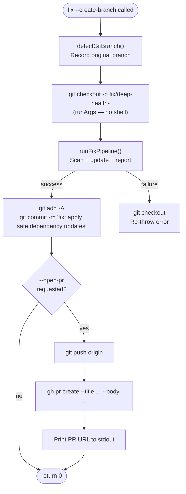

**Key invariant:** `git checkout -b <branchName>` always uses `runner.runArgs('git', ['checkout', '-b', branchName])` — never string interpolation — because branch names are external data that may contain shell metacharacters.

---

## Production Hardening

### Retry with backoff

`src/infrastructure/utils/retry.ts` exports `withRetry<T>(fn, opts)` — wraps all four Docker provisioner `run()` calls. Default: 3 attempts, 1s/2s/4s exponential backoff.

Retry triggers only on transient Docker errors (`docker pull`, `network timeout`, `connection refused`, `exit code 125`). Gate failures and business logic errors are never retried.

### Validation command timeouts

`ValidationCommandConfig.timeout_seconds` defaults to `300` (5 min) when not specified. Commands that hang past the limit are killed and reported as failed.

### Config versioning

`config_version: '1'` is an optional field in `project-config.yml`. Unsupported versions produce a user-friendly error:

```
Unsupported config_version "2". This version of deep-health supports config_version "1".
Run "deep-health init --force" to regenerate a compatible config.
```

### Optional googleapis

`googleapis` is in `optionalDependencies` and excluded from the bundle. Users who don't use Google Drive don't install it. `cloud-setup` and Drive upload show a clear install instruction if the package is absent.
